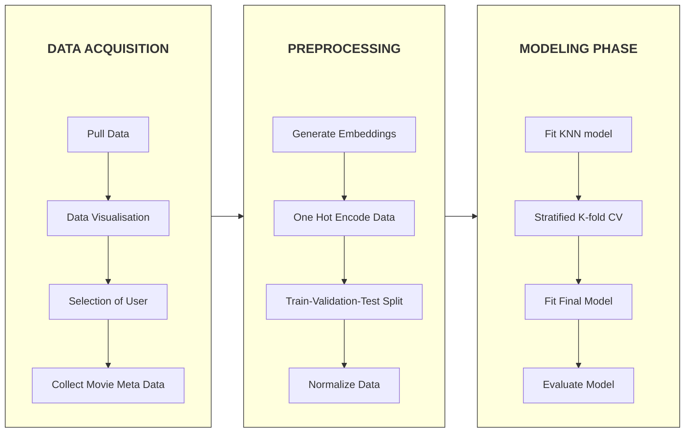

# Netflix Recommendation System

<div align="center">


</div>

<br>
<p align= "center">
We attempt to classify whether a user will watch a show using a KNN architecture. We train on the Netflix Prize Dataset.
</p>

## Workflow



<!--

1. Pulling Data from [Dataset](#dataset)
2. Data Visualisation
3. Extract Rated Movies and Ratings from One User
4. Collect Metadata of Rated Movies
5. Convert Metadata to Embeddings where Necessary
6. Train-Validation-Test Split
7. One Hot Encode and Normalize Data
8. Train KNN Model
9. Perform K-fold Cross-Validation to Find Optimal Parameters
10. Evaluate KNN Model on Test-Dataset
-->

## Dataset

<h3> Netflix Price Dataset  </h3>

The dataset can be found [here.](https://www.kaggle.com/datasets/netflix-inc/netflix-prize-data)

<h3> Context: </h3>
Netflix held the Netflix Prize open competition for the best algorithm to predict user ratings for films. The grand prize was $1,000,000 and was won by BellKor's Pragmatic Chaos team. This is the dataset that was used in that competition.

<br>
<h3> Dataset format: </h3>

The file "training_set.tar" is a tar of a directory containing 17770 files, one
per movie. The first line of each file contains the movie id followed by a
colon. Each subsequent line in the file corresponds to a rating from a customer
and its date in the following format:

<p align="center">
CustomerID,Rating,Date
</p>

MovieIDs range from 1 to 17770 sequentially.
CustomerIDs range from 1 to 2649429, with gaps. There are 480189 users.
Ratings are on a five star (integral) scale from 1 to 5.
Dates have the format YYYY-MM-DD.

## Usage
We require installation of the UV Python package and project manager. Instructions for installation can be found [here](https://docs.astral.sh/uv/getting-started/installation/). We also require git to be installed.

```
> git clone https://github.com/Cistaroth/IML-FINAL-PROJECT.git
> cd "IML-FINAL-PROJECT"
> uv sync
> uv run main.py
```

Raw data must be placed in the [raw_data](/raw_data/) folder. Please refer to the README.md of the aforementioned folder. To access processed data, the zip within the [processed_data](/processed_data/) folder must be unpacked.

## Report
The report can be found [here](https://www.overleaf.com/8783437716pkfsdmznyffg#48f67d).


## Credits
Developed as part of an Introduction to Machine Learning Course in 2025/2026

[@Cistaroth](https://github.com/Cistaroth) [@SyntaxSculptor1](https://github.com/SyntaxSculptor1) [@ctenderini-web](https://github.com/ctenderini-web)
