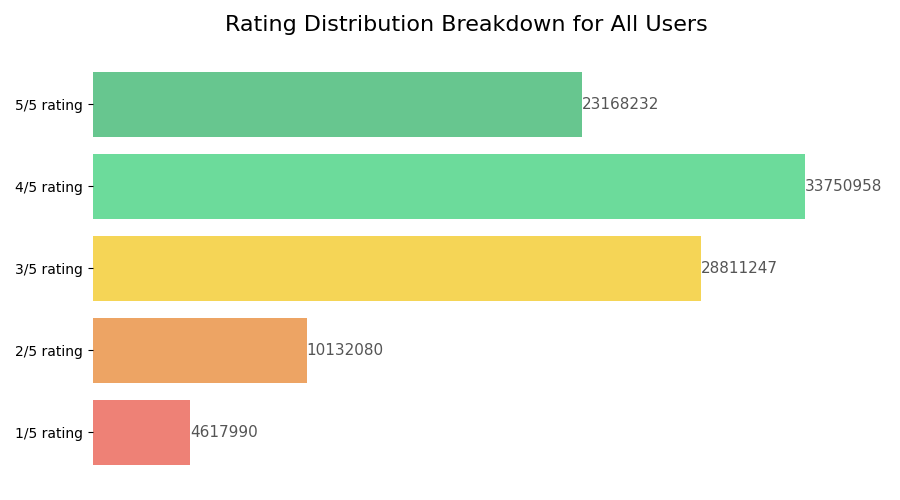
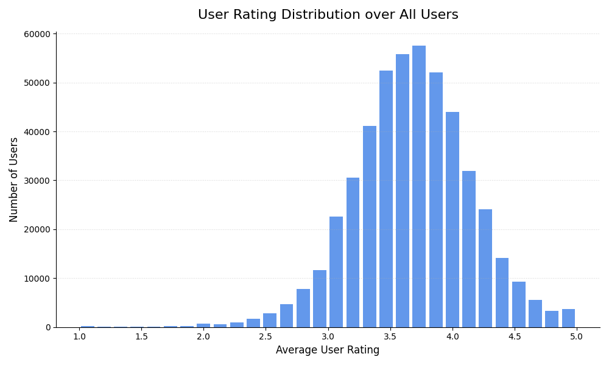
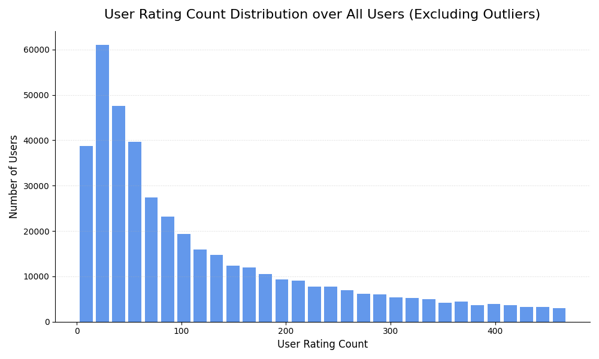
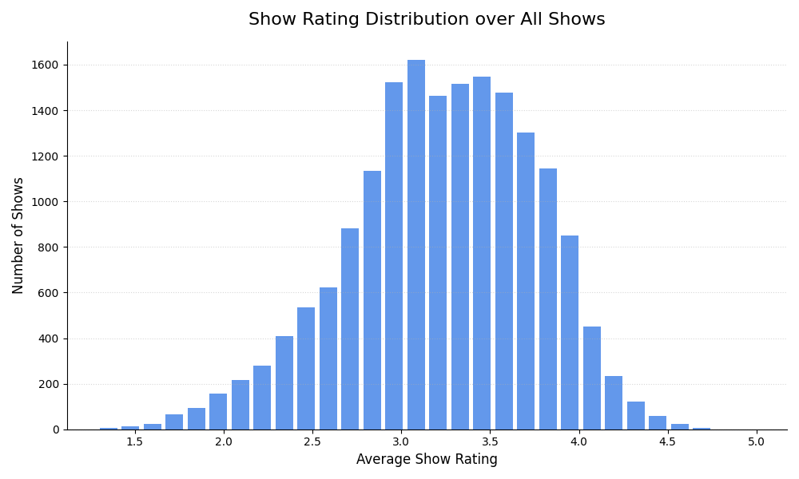
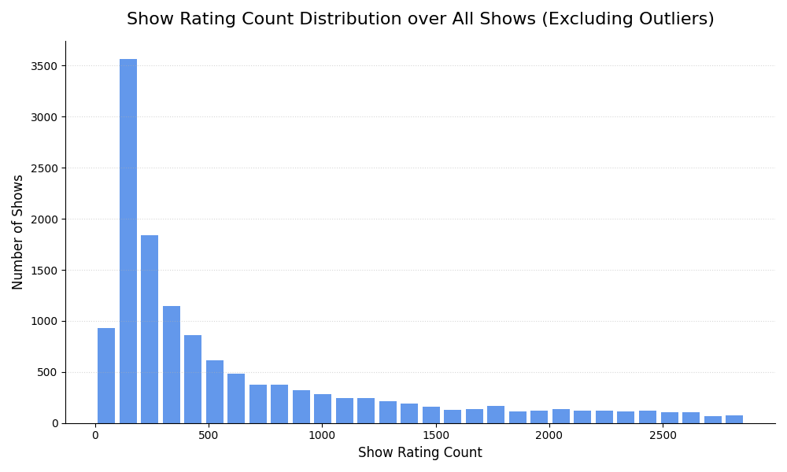
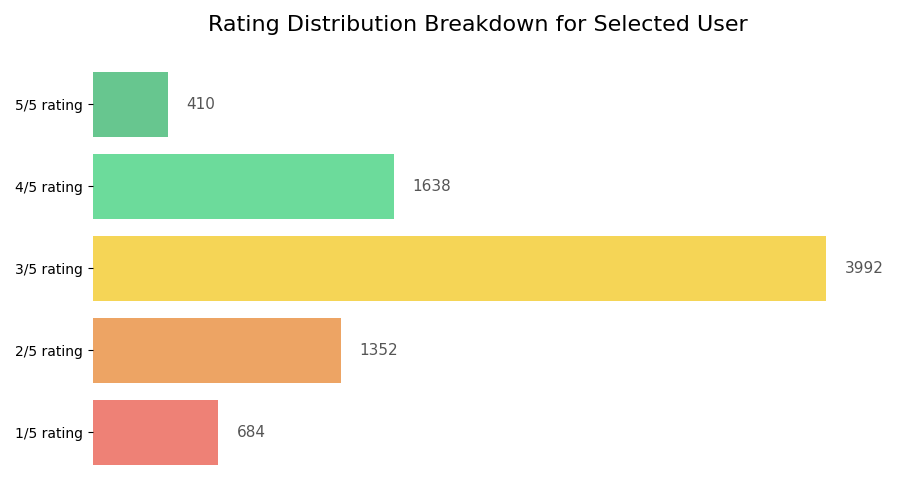

# Data Visualisation

## Full Dataset  - General Details

| Property | Value |
| --- | --- |
| `Unique Users` | 480189 |
| `Unique Shows` | 17770 |
| `Number of Ratings` | 100480507 |
| `Mean Rating` | 3.60 |
| `Standard Deviation Ratings` | 1.09 |

## User Metadata - General Details

| Property | Value |
| --- | --- |
| `User-ID` | 1314869 |
| `Mean Raw Rating` | 2.95 |
| `Standard Deviation Raw Ratings` | 0.98 |
| `Number of Raw Ratings` | 9740 |
| `Data Loss` | 1664 |
| `Data Loss Ratio` | 0.17 |
| `Mean Processed Rating` | 2.97 |
| `Standard Deviation Processed Ratings` | 0.95 |
| `Number of Processed Ratings` | 9740 |

## Candidates - General Details

| Property | Value |
| --- | --- |
| `Candidates Count` | 68330 |

## Full Dataset - Graphical Visualisation

## Selected User - Graphical Visualisations

